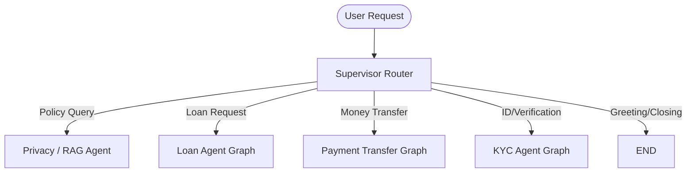
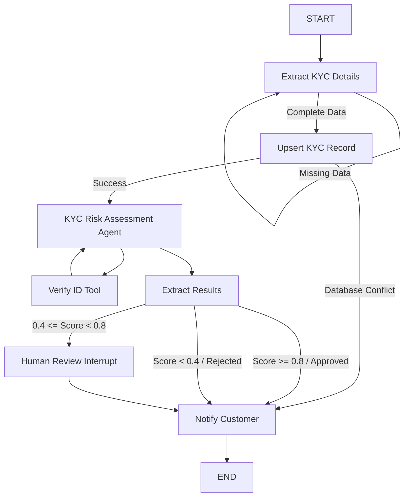
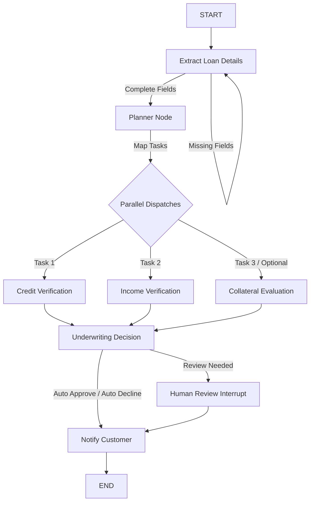
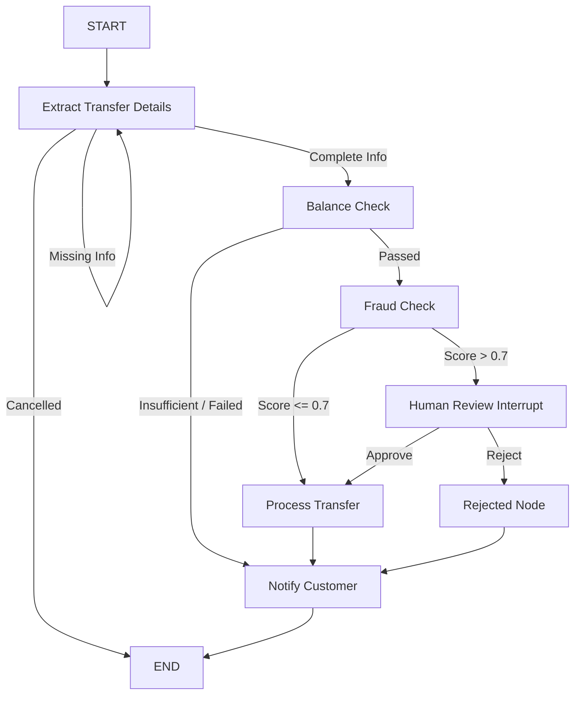

# Agentic Banking System (Multi-Agent Simulation)

An enterprise-grade simulation of an **Agentic Banking System** built with a multi-agent architectural design using **LangGraph**, **FastAPI**, **SQLAlchemy**, and a **React & TypeScript** dashboard. The system showcases advanced AI agent concepts: intent-based routing, parallel task execution (fan-out/fan-in), RAG-based query answering, structured data extraction, and human-in-the-loop (HITL) approval queues.

---

## System Architecture

The core of the application is a hierarchical supervisor-agent system. A **Master Supervisor Agent** routes user inquiries to dedicated departmental agent graphs based on user intent.



---

## Core Technologies & Backend Stack

*   **Orchestration Framework**: [LangGraph](https://github.com/langchain-ai/langgraph) (StateGraph, MemorySaver, parallel mapping, and `interrupt`/`Command` primitives for Human-in-the-Loop review)
*   **AI Integration**: LangChain Core / Community, LangChain OpenAI (interfacing with Google Gemini models via OpenRouter or direct APIs)
*   **Web Framework**: FastAPI (Uvicorn ASGI server, asynchronous endpoints, JWT Bearer Token auth middleware)
*   **Database & ORM**: SQLite with SQLAlchemy (transaction management, user state persistence, audit trail serialization)
*   **Vector DB & RAG**: Chroma (vector database), PyPDFLoader, RecursiveCharacterTextSplitter, HuggingFace Embeddings (`sentence-transformers/all-MiniLM-L6-v2`)
*   **Package Manager**: `uv` (modern Python workspace tool)

---

## Detailed Agent Graph Specifications (Backend-focused)

### 1. Supervisor Manager Agent
*   **State Schema**: `SupervisorState` (TypedDict holding session messages, `next_route` destination, user DB credentials injected via JWT, and status flags).
  

*   **Routing Logic**: Prompts `route_decision_llm` to determine the target department. Uses structured output mapping user query triggers directly to:
    *   `kyc_agent` (for ID updates, country status)
    *   `loan_agent` (for loan request inquiries)
    *   `payment_transaction_process_agent` (for funds transfers)
    *   `privacy_policy_agent` (for privacy, data handling, and compliance policies)
    *   `END` (greetings/closings)

---

### 2. KYC (Know Your Customer) Agent Graph
Verifies user identity, assesses geopolitical and profile risk, and records status in SQLite.




*   **Extraction Node**: Extracts required fields (`full_name`, `id_card_num`, `phone_number`, `nationality`) from chat history. Pauses execution using `interrupt()` if fields are missing to ask the user naturally.
*   **Verify Customer ID Tool (`verify_customer_id`)**: A custom LangChain `@tool` executing risk assessment logic on user profiles:
    *   High-risk nationality flag check (deducts `0.4` for countries like *North Korea, Iran, Afghanistan, Ukraine, Syria*).
    *   Database name match validation (deducts `0.3`).
    *   Profile completeness check (deducts `0.2` if phone number is absent).
*   **State Transitions**:
    *   `score >= 0.8` Automated KYC Approval
    *   `0.4 <= score < 0.8`  Interrupted for Admin Review (State saved in DB as `pending` for dashboard queue).
    *   `score < 0.4` Automated KYC Rejection

---

### 3. Loan Processing Agent Graph
Calculates risk tiers, debt-to-income ratios, and handles complex underwriting parallelization.




*   **Planner Node**: Reads the application state and maps target tasks according to `loan_purpose`. (e.g., `personal` loans only dispatch `credit_verification` and `income_verification`, while `mortgage`/`business` loans add `collateral_evaluation`).
*   **Parallel Execution (Fan-Out/Fan-In)**: Uses LangGraph `Send` API to parallelize verification nodes:
    *   `credit_verification`: Calculates credit score (550 to 750) based on monthly income bracket and flags risk events (`low_income`, `high_debt_ratio`).
    *   `income_verification`: Computes `verified_income_ratio` based on requested term and monthly earnings.
*   **Underwriting Decision Node**: Evaluates aggregated parameters:
    *   `Auto-Approve`: Credit score > 700, income ratio < 30%, and zero credit flags.
    *   `Auto-Decline`: Credit score < 600, income ratio > 50%, or risk flags present.
    *   `Human Review`: Moderate risk profiles trigger a LangGraph interrupt, persisting state to SQLite for human auditor approval.

---

### 4. Payment Transfer Agent Graph
Protects assets using transaction verification rules and real-time fraud profiling.




*   **Heuristic Fraud Engine**:
    *   `Signal 1 (Amount ratio)`: Calculates percentage of total account balance utilized. Triggers up to `0.9` risk score if >90% is sent.
    *   `Signal 2 (Temporal risk)`: High-risk hours flag (transactions sent between 12:00 AM and 5:00 AM receive a `0.9` risk score).
    *   `Signal 3 (Recipient risk)`: Base recipient risk modifier (`0.1`).
*   **Transaction Lock (Human-In-The-Loop)**: Transactions scoring above `0.7` are halted using `interrupt()`, awaiting human approval or rejection via the Admin Dashboard.
*   **Safe Execution**: Successful transfers execute an atomic atomic SQL update: decrementing sender balance, incrementing receiver balance, and committing a transaction log entry.

---

### 5. Privacy Policy Agent (RAG Pipeline)
*   **Document Parsing & Ingestion**: Processes `privacy_policy_for_banking_simulation_app.pdf` located in `/data/` using LangChain's `PyPDFLoader`.
*   **Chunking & Vectorization**: Splits document text using `RecursiveCharacterTextSplitter` (chunk size: 1000, overlap: 200). Generates vector representations using `sentence-transformers/all-MiniLM-L6-v2` embeddings.
*   **Vector Database Store**: Persists chunks to a local `Chroma` database directory.
*   **Retrieval Mechanism**: Implements `similarity_search` retrieving top 3 matching chunks for the user inquiry, feeding the result as a context block to the LLM to formulate strict answers.

---

## Database Schema (SQLAlchemy Models)

The relational schema is configured in `backend/app/models.py`:

| Model Name | Table Name | Columns | Relationships |
| :--- | :--- | :--- | :--- |
| **User** | `users` | `user_id` (PK), `full_name`, `id_card_num` (Unique), `phone_number`, `nationality`, `balance`, `email` (Unique), `password_hash`, `is_admin` | `accounts` (1:M), `loans` (1:M), `kyc_record` (1:1) |
| **Account** | `accounts` | `account_id` (PK), `account_number` (Unique), `user_id` (FK), `account_type`, `balance`, `status` | `owner` (M:1), `sent_transactions` (1:M), `received_transactions` (1:M) |
| **Loan** | `loans` | `loan_id` (PK), `user_id` (FK), `full_name`, `loan_amount`, `loan_purpose`, `monthly_income`, `loan_term_months`, `credit_score`, `verified_income_ratio`, `underwriting_decision`, `loan_status`, `notification_message` | `borrower` (M:1) |
| **Transaction** | `transactions` | `transaction_id` (PK), `from_account_id` (FK), `to_account_id` (FK), `amount`, `timestamp`, `status` | `sender` (M:1), `receiver` (M:1) |
| **KYC** | `kyc` | `kyc_id` (PK), `user_id` (FK, Unique), `kyc_score`, `verification_status`, `reject_reason`, `last_updated`, `audit_trail` (Text serializing full KYC chat history) | `user` (1:1) |

---

## API Routes

All endpoints are registered under `/api/v1` in `backend/app/main.py`:

*   **Authentication** (`/api/v1/auth`): `/login`, `/register`
*   **KYC Agent Router** (`/api/v1/kyc`): Submits documents, retrieves status, and triggers agent evaluation loops.
*   **Loan Agent Router** (`/api/v1/loan`): Submits loan parameters, processes extraction, and triggers evaluation workflows.
*   **Transfer Agent Router** (`/api/v1/transfer`): Manages funds dispatch validation, checking balances, and fraud score generation.
*   **Support/Privacy Agent Router** (`/api/v1/privacy`): Direct interface to RAG-powered vector search chat.
*   **Admin Orchestrator** (`/api/v1/admin`): Exposes queues of loans, KYC applications, and transfers flagged for review. Supports endpoints to `approve` or `reject` states to resume interrupted LangGraph executions.
*   **Manager / Supervisor Router** (`/api/v1/manager`): Entrypoint route that handles input query parsing and directs threads to their designated agent graphs.

---

## Frontend Overview
*   **Tech Stack**: React 18, TypeScript, Vite, TailwindCSS (styling).
*   **Pages & Portals**:
    *   `LoginPage` & `DashboardPage`: Displays active accounts, account balances, and past transactions.
    *   `TransferPage`, `KycPage` & `LoansPage`: Interactive conversation interfaces that communicate with the corresponding LangGraph backend agent.
    *   `AdminPortal`: Shows flagged transactions, pending loan applications, and pending KYC requests. Allows admin staff to make decisions and resume paused graphs.

---

## Installation & Running Guide

### Environment Configuration
Create a `.env` file inside the `backend` folder:
```env
OPENROUTER_API_KEY="your-openrouter-or-gemini-api-key"
SECRET_KEY="your-jwt-signing-secret"
ALGORITHM="HS256"
```

### Running Backend
Make sure you have python 3.12/3.13 installed (configured via `uv`).

1.  **Change directory to backend**:
    ```bash
    cd backend
    ```
2.  **Install dependencies using uv**:
    ```bash
    uv sync
    ```
3.  **One-time RAG Ingestion (Ingest Privacy PDF)**:
    ```bash
    uv run python -m app.agents.privacy_policy_agent.agent
    ```
    *(This parses `/data/privacy_policy_for_banking_simulation_app.pdf` and populates the `/chroma` vector directory).*
4.  **Run the FastAPI Server**:
    ```bash
    uv run uvicorn app.main:app --reload --port 8000
    ```

### Running Frontend
1.  **Change directory to frontend**:
    ```bash
    cd frontend
    ```
2.  **Install packages**:
    ```bash
    npm install
    ```
3.  **Run Vite Development server**:
    ```bash
    npm run dev
    ```
4.  Open `http://localhost:5173` in your browser.
